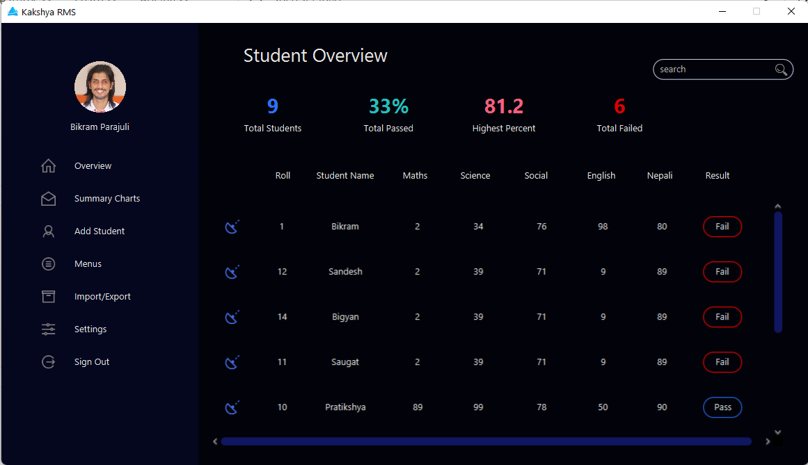
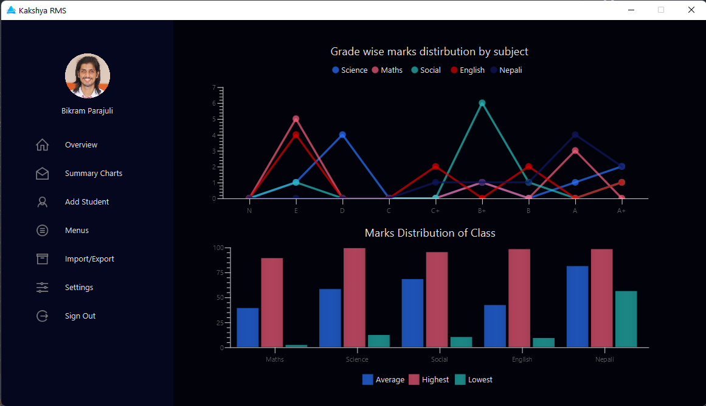
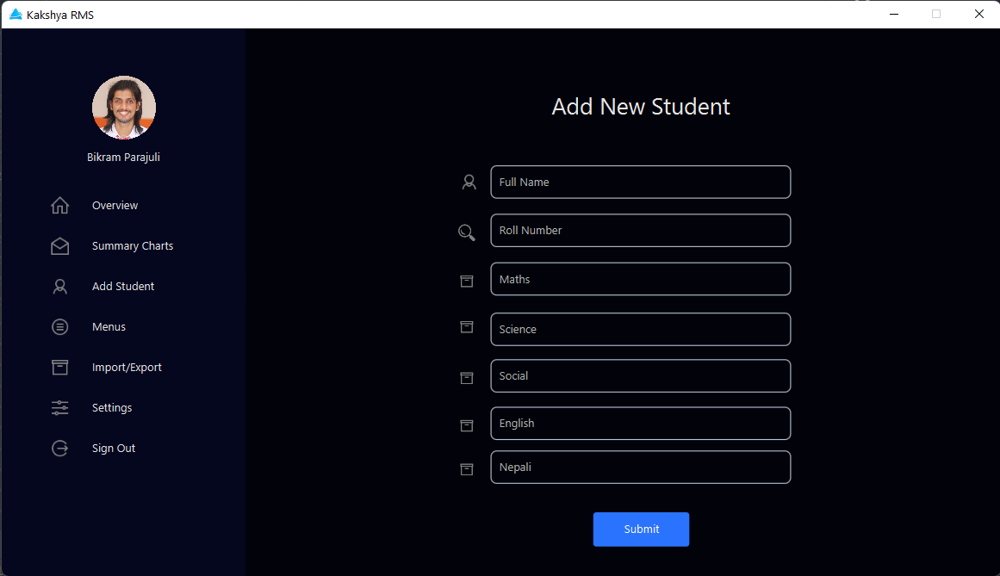
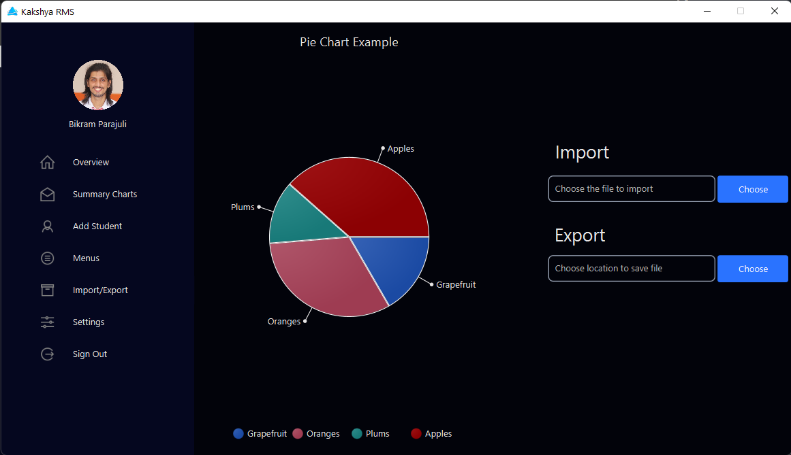
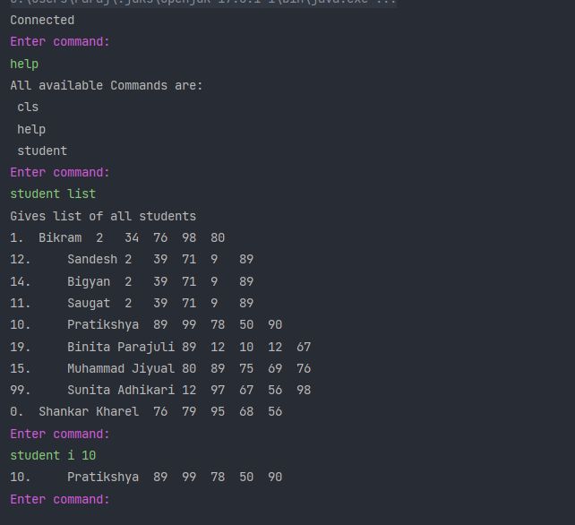
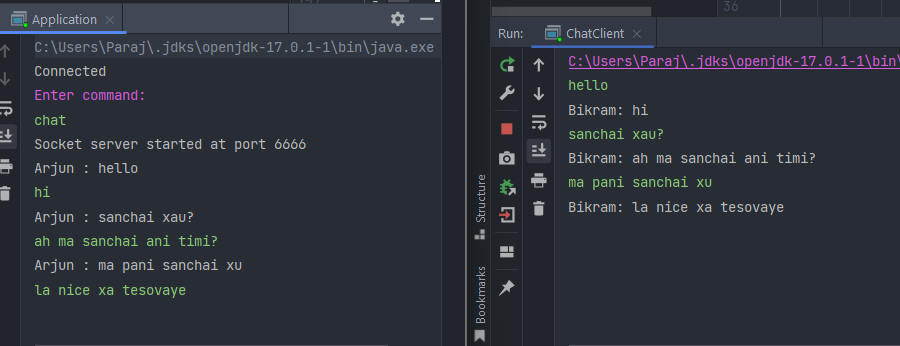

<!-- PROJECT SHIELDS -->
[![Contributors][contributors-shield]][contributors-url]
[![Forks][forks-shield]][forks-url]
[![Stargazers][stars-shield]][stars-url]
[![Issues][issues-shield]][issues-url]
[![MIT License][license-shield]][license-url]
[![LinkedIn][linkedin-shield]][linkedin-url]

<!-- PROJECT LOGO -->
 

  

<h3 align="center">Kakshya RMS</h3>

  

    A simple Java lab-work for the class of 'Programming in Java'
     
    <a href="https://github.com/Parajulibkrm/Java-labwork"><strong>Explore the docs »</strong></a>
     
     
    <a href="https://github.com/Parajulibkrm/Java-labwork">View Demo</a>
    ·
    <a href="https://github.com/Parajulibkrm/Java-labwork/issues">Report Bug</a>
    ·
    <a href="https://github.com/Parajulibkrm/Java-labwork/issues">Request Feature</a>
  

<!-- TABLE OF CONTENTS -->

  
Table of Contents

  <ol>
    <li>
      <a href="#about-the-project">About The Project</a>
      <ul>
        <li><a href="#built-with">Built With</a></li>
      </ul>
    </li>
    <li>
      <a href="#getting-started">Getting Started</a>
      <ul>
        <li><a href="#prerequisites">Prerequisites</a></li>
        <li><a href="#installation">Installation</a></li>
      </ul>
    </li>
    <li><a href="#usage">Usage</a></li>
    <li><a href="#roadmap">Roadmap</a></li>
    <li><a href="#contributing">Contributing</a></li>
    <li><a href="#license">License</a></li>
    <li><a href="#contact">Contact</a></li>
    <li><a href="#acknowledgments">Acknowledgments</a></li>
  </ol>

<!-- ABOUT THE PROJECT -->
## About The Project

[![kakshya CMS][product-screenshot]](#)

**Kakshya RMS** is a result management system app written in Java to understand the usage of various Java libraries and concepts.
Here's why:
* Every topic and concept is attempted to be implemented in the most practical way.
* This should help you to understand the concepts and learn the best way to implement them. :smile:

Thi is still a work in progress and you can help us by contributing to the project.

(<a href="#top">back to top</a>)

### Built With

The goal of the project was to cover almost/all the concepts and libraries of Java included in the curriculum of 'Programming in Java' class. Also, I have tried to avoid external libraries and frameworks.

* [IntelliJ Idea Community Edition](https://www.jetbrains.com/idea/download/)
* [Open Jdk 17 (Downloaded by from Intellij itself)](https://openjdk.java.net/install/)
* [JavaFx](https://openjfx.io/)
* Awt
* Swing
* [JDBC](https://docs.oracle.com/javase/tutorial/jdbc/basics/index.html)
* Socket
* [MySql with Xampp](https://www.apachefriends.org/index.html)

(<a href="#top">back to top</a>)

<!-- GETTING STARTED -->
## Getting Started

This is an example of how you may give instructions on setting up your project locally.
To get a local copy up and running follow these simple example steps.

### Prerequisites

JDK should be installed on your device along with JavaFx.

### Installation [TODO]

(<a href="#top">back to top</a>)

<!-- USAGE EXAMPLES -->
## Usage
Here are some of the screenshots of the application.

**Charts**

**Add Students**

**Import and Export Data with csv [Wip]**

**CLI based commands**

**CLI based chat system**

(<a href="#top">back to top</a>)

<!-- ROADMAP -->
## Roadmap

- [ ] Basics
    - [x] If Else
    - [x] While
    - [ ] Do while
    - [x] For Loop
    - [ ] For Each
    - [x] Switch Case
    - [x] Arrays
- [x] Basic Class
- [x] Access Modifiers
- [x] Constructors
- [ ] Nested Inner Class
- [ ] Final
- [x] Static
- [x] Inheritance
- [x] Super Class & its Access
- [x] Method Overriding
- [ ] Dynamic Method Dispatch
- [ ] Final with Inheritance
- [ ] Abstract Class
- [x] Interface
- [x] Implementing Interface
- [x] Interface can be Extended
- [ ] Nested Interface
- [x] Packages
- [ ] Setting Classpath
- [x] Exception Handling
- [ ] Multiple Catch
- [x] Nested Try
- [ ] Throw
- [ ] Finally
- [ ] Throws
- [x] Builtin Exception
- [ ] Chained Exception
- [ ] Create and Write on file
- [ ] Read file Content
- [ ] AWT
    - [x] AWT Controls
    - [x] Label
    - [x] Button
    - [x] TextField
    - [x] TextArea
    - [ ] CheckBox
    - [ ] Choice
    - [ ] List
    - [ ] Scrollbar
    - [ ] Menu
    - [ ] Flowlayout
    - [ ] BorderLayout
    - [x] GridLayout
    - [ ] CardLayout
    - [ ] GridBagLayout
    - [x] Events Classes
    - [x] Event Listeners
    - [x] Action Listener
    - [ ] Adjustment Listener
    - [ ] Component Listener
    - [ ] Container Listener
    - [ ] Focus Listener
    - [ ] Item Listener
    - [ ] Key Listener
    - [ ] Mouse Listener
    - [ ] MouseMotion Listener
    - [ ] MouseWheel Listener
    - [ ] Text Listener
    - [ ] WindowFocus Listener
    - [x] Window Listener
    - [ ] Adapter Class
    - [x] Close By Window Button
- [ ] Swing
    - [ ] Multicasting
    - [x] JFrame
    - [x] JTextField
    - [ ] JOptionPane
    - [ ] Dialog in Swing
- [ ] Graphics
    - [ ] Color Controls
    - [ ] Custom Font and Size
- [ ] Geometry
    - [ ] DrawArc Implementation
    - [ ] DrawOval Implementation
    - [ ] DrawRect Implementation
    - [ ] PolyLine Implementation
    - [ ] Polygon Implementation
    - [ ] Round Rectangle Implementation
- [ ] Database
    - [x] JDBC Connection
    - [x] SQL Commands
    - [x] Select Operation
    - [x] Create Operation
    - [ ] Create Table from Java Code
    - [ ] Update Operation
    - [ ] Delete Operation
- [ ] Networking
    - [ ] URL Class
    - [ ] InetAddress Class
    - [ ] URL Implementation
    - [ ] URL Connection Implementation
    - [ ] HttpURL Connection Implementation
    - [ ] Whois Implementation
- [x] Socket Programming
    - [x] Socket Chat Server
    - [x] Socket Chat Client

See the [open issues](https://github.com/Parajulibkrm/Java-labwork/issues) for a full list of proposed features (and known issues).

(<a href="#top">back to top</a>)

<!-- CONTRIBUTING -->
## Contributing

Contributions are what make the open source community such an amazing place to learn, inspire, and create. Any contributions you make are **greatly appreciated**.

If you have a suggestion that would make this better, please fork the repo and create a pull request. You can also simply open an issue with the tag "enhancement".
Don't forget to give the project a star! Thanks again!

1. Fork the Project
2. Create your Feature Branch (`git checkout -b feature/AmazingFeature`)
3. Commit your Changes (`git commit -m 'Add some AmazingFeature'`)
4. Push to the Branch (`git push origin feature/AmazingFeature`)
5. Open a Pull Request

### Cotributors

(<a href="#top">back to top</a>)

<!-- LICENSE -->
## License 

Distributed under the _MIT License_ however, you have to link back to the original source. Please do not the copy the project in its entirity and submit it as your own on your academic assignments. You can use the code as a reference but you cannot submit it as your own.

(<a href="#top">back to top</a>)

<!-- CONTACT -->
## Contact

Bikram Parajuli

You can find me on [![Twitter][1.2]][1], or on [![LinkedIn][2.2]][2]

(<a href="#top">back to top</a>)

<!-- ACKNOWLEDGMENTS -->
## Acknowledgments

Use this space to list resources you find helpful and would like to give credit to. I've included a few of my favorites to kick things off!

* [Github Awesome Readme](https://github.com/othneildrew/Best-README-Template#top)
* [Styling Javafx charts](https://docs.oracle.com/javafx/2/charts/css-styles.htm)
* [Java Notes](https://adhikariarjun.com.np/java-notes/)
* [Img Shields](https://shields.io)
* [Contrib Rocks](https://contrib.rocks)
* [UI Inspiration](https://github.com/k33ptoo/RestaurantMgtSampleUI/blob/master/src/home/Home.fxml)
* and [@arjunadikary](https://github.com/arjunadhikary)  for his help in setting up the environment.

(<a href="#top">back to top</a>)

<!-- MARKDOWN LINKS & IMAGES -->
<!-- https://www.markdownguide.org/basic-syntax/#reference-style-links -->
[contributors-shield]: https://img.shields.io/github/contributors/Parajulibkrm/Java-labwork.svg?style=for-the-badge
[contributors-url]: https://github.com/Parajulibkrm/Java-labwork/graphs/contributors
[forks-shield]: https://img.shields.io/github/forks/Parajulibkrm/Java-labwork.svg?style=for-the-badge
[forks-url]: https://github.com/Parajulibkrm/Java-labwork/network/members
[stars-shield]: https://img.shields.io/github/stars/Parajulibkrm/Java-labwork.svg?style=for-the-badge
[stars-url]: https://github.com/Parajulibkrm/Java-labwork/stargazers
[issues-shield]: https://img.shields.io/github/issues/Parajulibkrm/Java-labwork.svg?style=for-the-badge
[issues-url]: https://github.com/Parajulibkrm/Java-labwork/issues
[license-shield]: https://img.shields.io/github/license/Parajulibkrm/Java-labwork.svg?style=for-the-badge
[license-url]: https://github.com/Parajulibkrm/Java-labwork/blob/master/LICENSE.txt
[linkedin-shield]: https://img.shields.io/badge/-LinkedIn-black.svg?style=for-the-badge&logo=linkedin&colorB=555
[linkedin-url]: https://linkedin.com/in/parajulibkrm
[product-screenshot]: images/Screenshot.png
[1.2]: http://i.imgur.com/wWzX9uB.png (twitter icon without padding)
[2.2]: https://raw.githubusercontent.com/MartinHeinz/MartinHeinz/master/linkedin-3-16.png (LinkedIn icon without padding)
[1]: https://twitter.com/Parajulibkrm
[2]: https://www.linkedin.com/in/Parajulibkrm